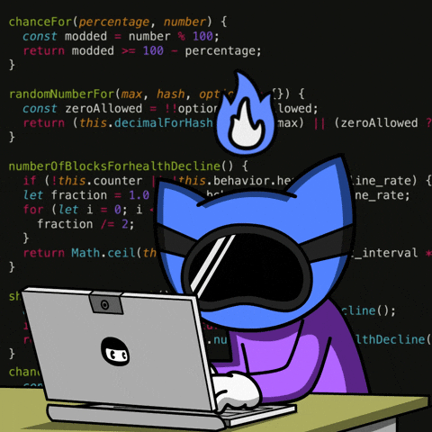

<p align="center">
  
</p>
<!-- 
=========================
     HERO: BINARY RAIN + TITLE
     ========================= -->

<p align="center">
  
</p>

<!-- If the GIF still doesn't show, comment the GIF block above and use this SVG fallback -->
<!--
<p align="center">
  
</p>
-->

<h1 align="center">Fnomer12</h1>
<h3 align="center">AI/ML Engineer • Ethical Hacker (in training) • AI Bots & Automation</h3>

<p align="center">
  
</p>

<p align="center">
  
  
  
  
</p>

<br/>

<!-- =========================
     ABOUT
     ========================= -->

## 🧠 About Me
- 🧠 **AI Engineer** building practical agents, automations, and intelligent systems  
- 🔐 Ethical hacking & cybersecurity practitioner *(learning + labs)*  
- 💻 **C++, Python, Java, JavaScript, PHP, SQL, C#, Next.js, Flutter**  
- 🧪 Focus: **secure AI systems, web security fundamentals, OSINT, automation**  
- 🌍 Based in Africa  

> I break things in labs so they don’t break in production.

---

## 🛠️ Core Stack
```text
AI / Automation: Python | Agents | APIs | Workflows
Security: Linux | Nmap | Wireshark | Burp (intro) | OSINT
Dev: Next.js | JavaScript | C# | Flutter | SQL


# 🛡️ Sampson | Ethical Hacker in Training

```bash
┌──(fnomer㉿kali)-[~/security]
└─$ whoami
Ethical Hacker | Systems Programmer | Security Learner | AI Engineer

🧠 About Me

🧠 AI Engineer & Machine Learning Enthusiast

🔐 Ethical hacking & cybersecurity practitioner

💻 Strong background in C++, Python, Java, JavaScript, PHP, SQL, C#, Next.js, Flutter

🤖 Building intelligent systems with a focus on security, automation, and reliability

🌍 Based in Africa

🧪 Learning penetration testing, secure systems, and adversarial thinking

📚 Building strong foundations before advanced exploits

I break things in labs so they don’t break in production.

- 🧠 AI Engineer focused on intelligent, secure systems
- 🤖 Machine Learning, automation & applied AI
- 🔐 Ethical hacking & cybersecurity enthusiast

