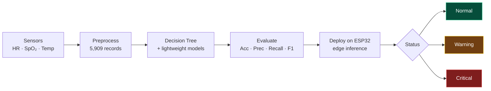

<p align="center">
   &nbsp;  &nbsp;  &nbsp;  &nbsp;  &nbsp;  &nbsp; 
</p>

<p align="center">
  
</p>

<p align="center">
  
</p>

<p align="center">
  <a href="https://github.com/Fnomer12"></a>
</p>

<p align="center">
  <a href="https://linkedin.com/in/sampson-adjei-b594002b5" title="Connect on LinkedIn"></a>
  <a href="https://skairotech.com" title="Visit Skairo"></a>
  <a href="mailto:skeng246@gmail.com" title="Send me an email"></a>
  
</p>

---

###  About me

I'm a Computer Science student at **Valley View University** and Founder & CEO of **Skairo Advanced Technologies** in Accra. I build with computer vision today, and I'm working toward machines that can **see, understand, reason and act** in the real world.

<details>
<summary> <b>Run <code>Sampson.forward()</code></b> — click to expand</summary>
<br/>

```python
import torch.nn as nn

class Sampson(nn.Module):
    """AI/ML Engineer · Software Engineer · AI Researcher — Accra, Ghana"""

    def __init__(self):
        super().__init__()
        self.education = "B.Sc. Computer Science @ Valley View University (2024–2027)"
        self.role      = ["Founder & CEO @ Skairo", "AI Engineer @ 300 Million Legacy",
                          "COSSA President @ VVU"]
        self.perceive  = ["YOLO", "OpenCV", "PyTorch"]            # what I've built with
        self.reason    = ["LLMs", "Transformers", "Multimodal AI"] # what I'm going deeper into
        self.act       = ["Robotics", "Autonomous Systems", "VLA models"]

    def forward(self, world):
        seen     = self.perceive(world)       # detect objects
        meaning  = self.reason(seen)          # understand the situation
        return self.act(meaning, safely=True) # decide what happens next
```

```text
Epoch 2026 | loss: 0.042 ↓ | currently training on:
  ████████████████████░░░░  Computer Vision ........ 85%
  ███████████████░░░░░░░░░  Transformers & LLMs .... 62%
  ███████████░░░░░░░░░░░░░  Multimodal / VLA ....... 45%
  ████████░░░░░░░░░░░░░░░░  Reinforcement Learning . 33%
```

</details>

---

###  Research Direction

Most vision systems stop at *"there's a cup on the table."* I'm interested in what comes after — connecting **perception, language, reasoning and action**, so a robot told to *"clear the table"* can understand the instruction, recognise the objects, plan the task and do it safely.

```mermaid
flowchart LR
    subgraph P[" PERCEIVE "]
        V((Vision))
        L((Language))
        S((Sensors))
        H((Human intent))
    end
    subgraph U[" UNDERSTAND "]
        U1(( ))
        U2(( ))
        U3(( ))
    end
    subgraph R[" REASON "]
        R1(( ))
        R2(( ))
        R3(( ))
    end
    subgraph A[" ACT "]
        A1([Plan the task])
        A2([Decide])
        A3([Act safely])
    end
    V & L & S & H --> U1 & U2 & U3
    U1 & U2 & U3 --> R1 & R2 & R3
    R1 & R2 & R3 --> A1 & A2 & A3
    classDef inp fill:#000000,stroke:#ef4444,color:#ffffff,stroke-width:2px
    classDef hid fill:#1a0505,stroke:#b91c1c,stroke-width:2px
    classDef rsn fill:#450a0a,stroke:#ef4444,stroke-width:2px
    classDef out fill:#b91c1c,stroke:#ff1e1e,color:#ffffff,stroke-width:2px
    class V,L,S,H inp
    class U1,U2,U3 hid
    class R1,R2,R3 rsn
    class A1,A2,A3 out
```



<p align="center"><i>“What happens after a machine can see?”</i><br/><sub><code>"clear the table" → detect objects → infer intent → plan → act</code></sub></p>

<table>
<tr>
<td width="50%" valign="top">

 **Focus areas**
- Neural networks & the maths of how they learn
- Transformers · attention · embeddings · LLMs
- Multimodal foundation & vision-language-action models
- Reinforcement learning & embodied AI
- Interpretability & reliability of AI decisions

</td>
<td width="50%" valign="top">

 **The core question**
> How do we build machines that understand what they see, understand humans, learn from their environment and take useful, *safe* action in the real world?

</td>
</tr>
</table>

---

###  Featured Projects <sub><sup>— click a project to open it</sup></sub>

<details>
<summary> <b>ESP32 TinyML Health Monitor</b> &nbsp;<code>Final-Year Research · 2026–</code><br/><sub>&nbsp;&nbsp;&nbsp;&nbsp;&nbsp;&nbsp;&nbsp;Edge-AI early warning from heart rate, SpO₂ and body temperature</sub></summary>
<br/>

- Classifies physiological readings as **Normal**, **Warning** or **Critical**
- Preprocessed and analysed a **5,909-record** physiological dataset
- Built an initial **Decision Tree** classifier in Python / scikit-learn (Google Colab), with lighter models planned for comparison
- Evaluating with accuracy, precision, recall, F1, confusion matrix and feature importance
- Next: deploy to **ESP32** for real-time edge inference and measure speed, memory and efficiency



`Python` `scikit-learn` `TinyML` `ESP32` `Google Colab`

</details>

<details>
<summary> <b>Skairo Vision</b> &nbsp;<code>AI & Computer Vision</code><br/><sub>&nbsp;&nbsp;&nbsp;&nbsp;&nbsp;&nbsp;&nbsp;Intelligent CCTV — real-time detection and security intelligence</sub></summary>
<br/>

- AI-powered platform for intelligent CCTV monitoring
- Real-time object detection, visitor management and security intelligence
- Built on Python, OpenCV and YOLO-based detection pipelines

`YOLO` `OpenCV` `PyTorch` `Python`

</details>

<details>
<summary> <b>CEA Digital Platform</b> &nbsp;<code>Government Technology</code><br/><sub>&nbsp;&nbsp;&nbsp;&nbsp;&nbsp;&nbsp;&nbsp;Digital platform for Ghana's Complementary Education Agency</sub></summary>
<br/>

- Manages news, programmes, regional information, events, newsletters, galleries and public communication
- Built for scalable content management, usability and digital accessibility

`Next.js` `CMS` `Accessibility`

</details>

<details>
<summary> <b>Skairo Restaurant Tech</b> &nbsp;<code>Hospitality Technology</code><br/><sub>&nbsp;&nbsp;&nbsp;&nbsp;&nbsp;&nbsp;&nbsp;QR-powered digital ordering for restaurants</sub></summary>
<br/>

- Customers scan a QR code, browse the menu and order from their phone
- Simplifies ordering and day-to-day restaurant operations

`Full-stack` `QR` `Ordering flow`

</details>

---

###  Tech Stack <sub><sup>— icons link to the docs</sup></sub>

<p align="center">
  <a href="https://python.org" title="Python"></a> <a href="https://pytorch.org" title="PyTorch"></a> <a href="https://opencv.org" title="OpenCV"></a> <a href="https://isocpp.org" title="C++"></a> <a href="https://learn.microsoft.com/dotnet/csharp/" title="C#"></a> <a href="https://rust-lang.org" title="Rust"></a> <a href="https://developer.mozilla.org/docs/Web/JavaScript" title="JavaScript"></a>
</p>
<p align="center">
  <a href="https://reactnative.dev" title="React Native"></a> <a href="https://nextjs.org" title="Next.js"></a> <a href="https://flutter.dev" title="Flutter"></a> <a href="https://firebase.google.com" title="Firebase"></a> <a href="https://php.net" title="PHP"></a> <a href="https://docker.com" title="Docker"></a> <a href="https://kali.org" title="Kali Linux"></a> <a href="https://git-scm.com" title="Git"></a> <a href="https://kernel.org" title="Linux"></a>
</p>

| Layer | Stack |
|---|---|
|  **AI / ML** | PyTorch · YOLO · OpenCV · scikit-learn · Computer Vision · TinyML · Data Analysis |
|  **Languages** | Python · C++ · C# · JavaScript · Rust · PHP · SQL |
|  **Apps** | Next.js · React Native · Flutter · Firebase |
|  **Systems** | Docker · Kali Linux · Git · QA & Software Testing |

---

###  Experience — layer by layer

| | Role | Where | When |
|---|---|---|---|
|  | **Founder & CEO** | [Skairo Advanced Technologies](https://skairotech.com) · Accra | 2026 – now |
|  | **AI Engineer** — PiCUA computer-use, Golem AI security | 300 Million Legacy Inc. · Palo Alto | 2025 – now |
|  | **Business Development Manager** — AI QA | Human In The Loop · Palo Alto | 2025 – now |
|  | **COSSA President** — founded AI, SWE & UI/UX clubs | Valley View University | 2026 – 2027 |
|  | **Team Manager** — research & documentary | DDamoah Studios | 2025 |

###  Recognition

-  **The Webby Awards 2026** — Best Responsible AI Implementation *(contributor, Human In The Loop)*
-  **W3 Awards 2025** — Silver, Best Emerging Tech *(contributor, DDamoah Studios)*
-  Cisco Networking Academy — Introduction to Packet Tracer

---

###  Neural Library

<details>
<summary> <b>Papers & resources I'm learning from</b> — click to open</summary>
<br/>

| Topic | Read |
|---|---|
|  **Neural nets, intuitively** | [3Blue1Brown — Neural Networks](https://www.3blue1brown.com/topics/neural-networks) |
|  **Build them from scratch** | [Karpathy — Neural Networks: Zero to Hero](https://karpathy.ai/zero-to-hero.html) |
|  **Transformers** | [Attention Is All You Need (2017)](https://arxiv.org/abs/1706.03762) |
|  **Deep CNNs** | [ResNet — Deep Residual Learning (2015)](https://arxiv.org/abs/1512.03385) |
|  **Object detection** | [YOLO — You Only Look Once (2015)](https://arxiv.org/abs/1506.02640) |
|  **Vision + language** | [CLIP — Learning Transferable Visual Models (2021)](https://arxiv.org/abs/2103.00020) |
|  **Embodied multimodal** | [PaLM-E (2023)](https://arxiv.org/abs/2303.03378) |
|  **Vision-language-action** | [RT-2 (2023)](https://arxiv.org/abs/2307.15818) |
|  **Reinforcement learning** | [OpenAI Spinning Up](https://spinningup.openai.com) |
|  **Interpretability** | [Transformer Circuits](https://transformer-circuits.pub) · [Distill](https://distill.pub) |

</details>

---

###  GitHub Activity

<p align="center">
  <picture>
    <source media="(prefers-color-scheme: dark)" srcset="https://raw.githubusercontent.com/Fnomer12/Fnomer12/output/snake-dark.svg" />
    <source media="(prefers-color-scheme: light)" srcset="https://raw.githubusercontent.com/Fnomer12/Fnomer12/output/snake-light.svg" />
    
  </picture>
</p>

<p align="center">
  
  
</p>
<p align="center">
  
</p>

---

<p align="center">
  
</p>


